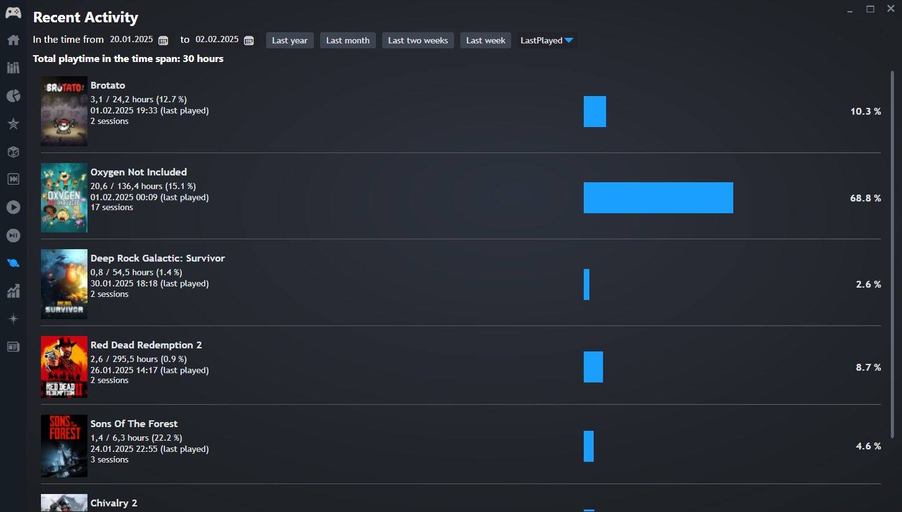

# Playnite Recent Activity

Extension for [Playnite](https://playnite.link/).

## Description
Displays your recent playing activity with some statistics.

## Requirements
The [GameActivity](https://github.com/Lacro59/playnite-gameactivity-plugin) extension is required for this plugin.

# Thanks
The logic to retrieve the activity data from the GameActivity extension is mostly copied and heavily inspired
from the [YearInReview](https://github.com/SparrowBrain/Playnite.YearInReview) extension by 
[SparrowBrain](https://github.com/SparrowBrain).

Thank you very much for the great work!

# Note
This extension was originally intended as a proof of concept for personal use only.
I am new to Playnite development and just wanted to see if I could get this to work.
Therefore the code is not very optimized and might be a bit messy. 

I just tried to have it work for me with minimal effort :)
Im open to any contributions or suggestions to improve this extension.
